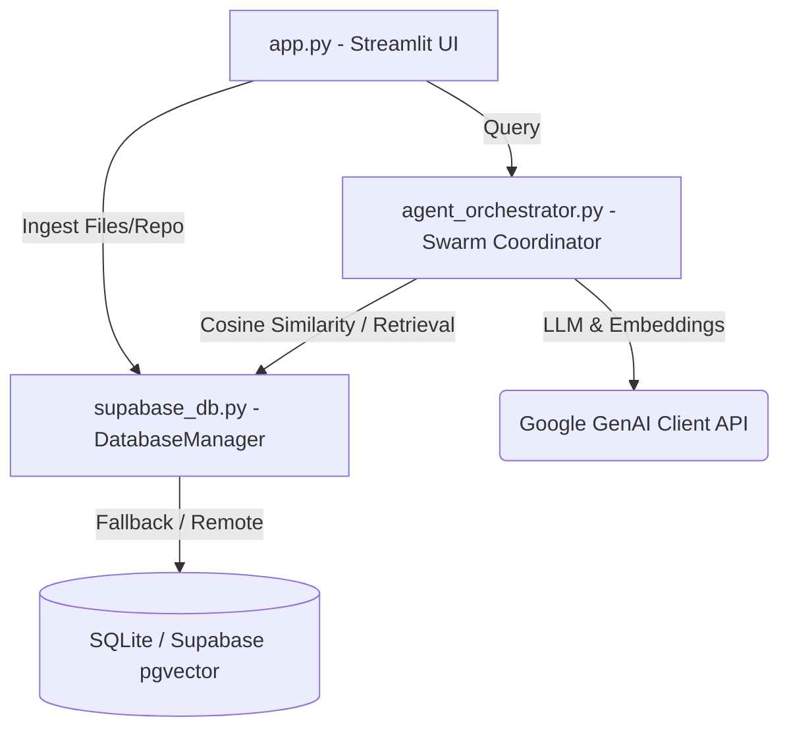

# AI Software Engineer Assistant 🧠🤖

A high-fidelity, multi-agent workspace designed for codebase exploration, repository indexing, and interactive developer question-answering. The project combines a beautiful space-blue glassmorphic Streamlit dashboard with a state-of-the-art Multi-Agent Swarm Orchestrator and vector similarity search.

---

## ⚡ Core Features

1. **Multi-Agent Swarm Orchestrator**:
   * **Planner Agent**: Analyzes user questions, evaluates the catalog of indexed files, and generates a structured keyword search plan.
   * **Code Search Agent**: Executes semantic vector search and keyword scans across source code index chunks.
   * **Doc Search Agent**: Targets API definitions, design documentation, and markdown files to retrieve configuration contexts.
   * **Answer Generator Agent**: Synthesizes retrieved codebase contents and planning parameters into a final developer-ready solution using Gemini models.

2. **Ingestion & Indexing Engine**:
   * **Single File Ingest**: Supports uploading individual source files, API docs, or design text.
   * **GitHub Ingestion**: Downloads public GitHub repositories via ZIP branch downloads, filters out boilerplate files (e.g., `node_modules`, `venv`, binary files), auto-detects programming languages, and indexes entire repositories at once.
   * **Line-Based Sliding Chunking**: Splits large documents into manageable segments of 40 lines with a 5-line sliding overlap to preserve file context.

3. **Hybrid Vector Database Routing**:
   * **Supabase Integration**: Connects to Supabase with pgvector support for remote storage and server-side vector operations.
   * **SQLite Local Fallback**: Gracefully falls back to a local SQLite database (`assistant.db`) if Supabase is unconfigured, storing embeddings as serialized float arrays and computing in-memory cosine similarity searches.
   * **Google GenAI Embeddings**: Uses the `google-genai` SDK and the `text-embedding-004` model for high-accuracy embedding vectors.

4. **Premium Space-Blue UI Dashboard**:
   * Outlined with glowing space-blue and hot-magenta neon boundaries (`#00f0ff` / `#d946ef`).
   * Custom Plotly gauge dials, dual-spline traffic area graphs, and percentage donut arrays.
   * Dedicated pages: **Home** (Dashboard Metrics), **Console** (Interactive Swarm Terminal), **Data** (Codebase Ingestion), **Destinations** (Query History Logs), **Tasks** (Agent Pipeline Traces), **Devices** (Cluster maps), and **Settings** (Theme & API configuration).

---

## 📂 Project Architecture



### Key Files
* **[app.py](file:///f:/AI%20Software%20Engineer%20Assistant/app.py)**: Handles the Streamlit page rendering, theme definitions, visual grid styling, custom component HTML/CSS, Plotly data figures, and page routing.
* **[agent_orchestrator.py](file:///f:/AI%20Software%20Engineer%20Assistant/agent_orchestrator.py)**: Manages agent prompts, sequence execution log triggers, and coordinates Planner, Code Search, Doc Search, and Generator workflows.
* **[supabase_db.py](file:///f:/AI%20Software%20Engineer%20Assistant/supabase_db.py)**: Wraps embedding calls, manages sliding text chunk calculations, SQLite/Supabase operations, and in-memory cosine similarity search functions.
* **[requirements.txt](file:///f:/AI%20Software%20Engineer%20Assistant/requirements.txt)**: Defines external dependencies.

---

## ⚙️ Environment Configuration

Copy the sample environment file to `.env`:
```bash
cp .env.example .env
```

Define the configuration parameters:

| Variable | Description | Required | Default |
|---|---|---|---|
| `GEMINI_API_KEY` | Google Gemini API Key | **Yes** | None |
| `SUPABASE_URL` | Supabase Postgres URL | No | SQLite fallback |
| `SUPABASE_KEY` | Supabase API Service Key | No | SQLite fallback |

---

## 🚀 Getting Started

### 1. Setup Virtual Environment & Dependencies
Initialize a virtual environment and install the required python dependencies:
```bash
python -m venv venv
venv\Scripts\activate   # On Windows
source venv/bin/activate  # On Linux/macOS
pip install -r requirements.txt
```

### 2. Configure Environment Keys
Create a `.env` file in the root directory and add your Google Gemini API key:
```env
GEMINI_API_KEY=AIzaSy...
```

### 3. Launch the Application
Run the Streamlit server:
```bash
streamlit run app.py --server.port 8505
```
Open [http://localhost:8505](http://localhost:8505) in your web browser.

---

## 🗄️ Database Schema Details

### SQLite Fallback (`assistant.db`)
When running locally without Supabase, the following tables are automatically initialized inside `assistant.db`:

#### `assistant_files`
Stores the metadata and raw content of ingested files.
* `id`: `INTEGER PRIMARY KEY AUTOINCREMENT`
* `filename`: `TEXT`
* `file_type`: `TEXT` (`source_code`, `api_doc`, `design_doc`)
* `content`: `TEXT`
* `language`: `TEXT`
* `size_bytes`: `INTEGER`
* `created_at`: `TIMESTAMP`

#### `assistant_file_chunks`
Stores overlapping chunks of text along with their high-dimensional vector embeddings.
* `id`: `INTEGER PRIMARY KEY AUTOINCREMENT`
* `file_id`: `INTEGER NOT NULL` (Foreign key to `assistant_files`)
* `chunk_index`: `INTEGER`
* `content`: `TEXT`
* `embedding`: `TEXT` (JSON array of floats representing the embedding vector)

#### `assistant_queries`
Logs swarm orchestrator queries and answers.
* `id`: `INTEGER PRIMARY KEY AUTOINCREMENT`
* `question`: `TEXT`
* `plan`: `TEXT`
* `retrieved_files`: `TEXT` (JSON array of filenames)
* `answer`: `TEXT`
* `created_at`: `TIMESTAMP`
