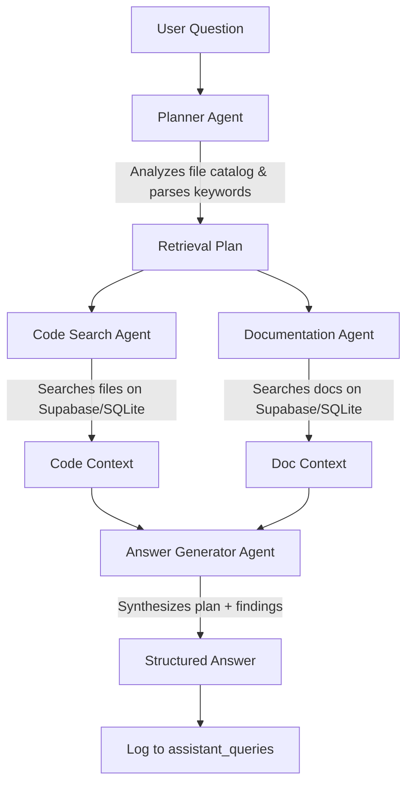

# Walkthrough: AI Software Engineer Assistant

This project implements a multi-agent system designed to act as an automated code reviewer, tester, and technical writer. It connects to **Supabase** (falling back to local SQLite) to search codebases and documentation, running an agentic pipeline to solve complex developer queries.

## 🚀 Key Features

1. **Dual-Mode Database Layer (`supabase_db.py`)**: Interacts with Supabase tables (`assistant_files`, `assistant_queries`) and includes a self-contained local SQLite fallback (`assistant.db`) for offline or direct execution.
2. **Multi-Agent Orchestrator (`agent_orchestrator.py`)**: Executes a structured pipeline powered by Gemini models:
   - **Planner Agent**: Analyzes the question and catalog, determines key terms and files to search.
   - **Code Search Agent**: Queries Supabase/SQLite index for relevant source code files.
   - **Documentation Agent**: Queries Supabase/SQLite index for API specs and architectural design documents.
   - **Answer Generator Agent**: Synthesizes the final answer using retrieved source files and documentation.
3. **Interactive Streamlit Web Dashboard (`app.py`)**:
   - A glassmorphic web dashboard showing active workspace statistics.
   - **Ingestion Workspace**: Allows drag-and-drop file upload (Source Code, API Docs, Design Docs) indexing them directly into the database.
   - **Agent Console**: Live execution progress showing agent logs, details, and the final synthesized response side-by-side.
   - **Workspace Previewer**: Let's users view files and delete them.
   - **Query History Log**: Historical overview of questions run, plans generated, and answers.
   - **One-Click Seeding**: Automatically populates the database with a preloaded sample auth codebase (complete with a security vulnerability).

---

## 🛠️ Project Structure

```
AI Software Engineer Assistant/
├── .env                  # Private configuration (loaded dynamically)
├── .env.example          # Template environment config
├── requirements.txt      # Python dependencies
├── supabase_db.py        # Supabase client & SQLite DB layer
├── agent_orchestrator.py # Multi-Agent workflow coordinator
└── app.py                # Main Streamlit web dashboard
```

---

## 💻 Setup & Installation Instructions

### 1. Prerequisites
Ensure you have Python installed (Python 3.10+ recommended).

### 2. Install Dependencies
Run the package installation:
```bash
pip install -r requirements.txt
```

### 3. Database Configurations (Supabase Setup)
To connect your app to a live Supabase instance:
1. Create a project in [Supabase](https://supabase.com).
2. Go to **SQL Editor** in Supabase and run the DDL schema to set up the tables:
   ```sql
   -- Table for storing workspace files
   CREATE TABLE assistant_files (
       id uuid DEFAULT gen_random_uuid() PRIMARY KEY,
       filename text NOT NULL,
       file_type text NOT NULL, -- 'source_code', 'api_doc', 'design_doc'
       content text NOT NULL,
       language text,
       size_bytes int8,
       created_at timestamp DEFAULT now()
   );

   -- Table for storing query execution logs
   CREATE TABLE assistant_queries (
       id uuid DEFAULT gen_random_uuid() PRIMARY KEY,
       question text NOT NULL,
       plan text,
       retrieved_files text, -- JSON array of file names
       answer text,
       created_at timestamp DEFAULT now()
   );
   ```
3. Set your Supabase URL and Key in a `.env` file:
   ```env
   GEMINI_API_KEY=your-gemini-api-key
   SUPABASE_URL=https://your-project-ref.supabase.co
   SUPABASE_KEY=your-supabase-service-role-or-anon-key
   ```
*If these variables are omitted, the app will automatically operate in offline SQLite mode, using `assistant.db` locally.*

### 4. Run the Application
Start the Streamlit development server:
```bash
streamlit run app.py --server.port 8505
```
Open `http://localhost:8505` to view your workspace.

---

## 🎨 Premium Cyberpunk Layout (Theme 1)
The application includes a state-of-the-art dark glassmorphic dashboard featuring:
* **Sidebar Profile & Nav**: Header logo (`dp DEV_PULSE`), Architect card (`Alex R. // ARCHITECT`), online status, and modular menu selectors.
* **Top Header Terminal**: A simulated live developer status terminal showing system health, latency, and pipeline status.
* **Metric Cards & Analytics**: Real-time Interactive Plotly line charts plotting memory, CPU usage, and requests flow.
* **Connection Status Footer**: Displays live connectivity states to Supabase with automatic SQLite local fallback.

---

## 🤖 Multi-Agent Workflow Blueprint



1. **Planner Agent**: Inspects the catalogs of filenames and writes a retrieval plan specifying search keywords and target files.
2. **Code Search Agent**: Interacts with the DB layer to query source code matches.
3. **Documentation Agent**: Queries API references, design diagrams, or requirement specifications.
4. **Answer Generator Agent**: Synthesizes the user query, code snippets, documentation, and plan guidelines into a clear, detailed response.
