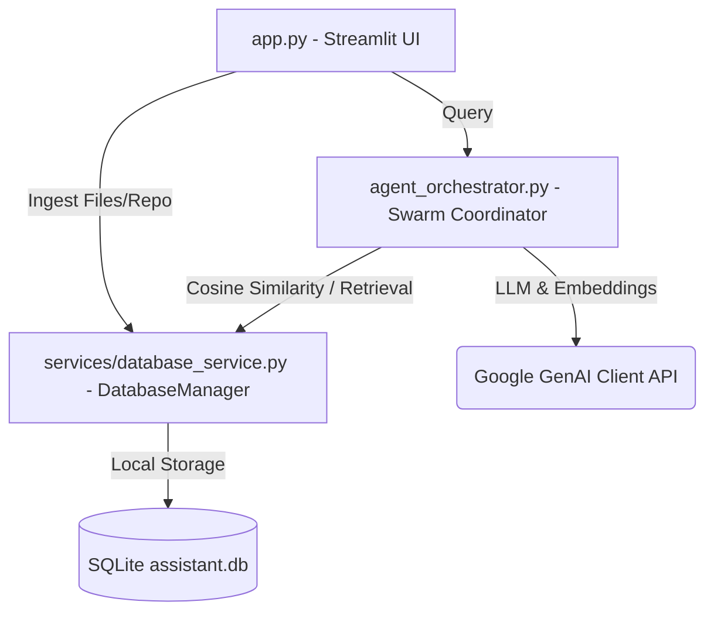

# AI Software Engineer Assistant 🧠🤖

A high-fidelity, unified developer workspace designed for codebase exploration, repository indexing, and interactive codebase Q&A. The project combines a space-blue glassmorphic Streamlit dashboard with a state-of-the-art Multi-Agent Swarm Orchestrator and local vector similarity search.

---

## ⚡ Core Features

1. **Multi-Agent Swarm Orchestrator**:
   * **Planner Agent**: Analyzes user questions, evaluates the catalog of indexed files, and generates a structured keyword search plan.
   * **Code Search Agent**: Executes semantic vector similarity scans across source code index chunks.
   * **Doc Search Agent**: Targets API definitions, design documentation, and markdown files to retrieve configuration contexts.
   * **Answer Generator Agent**: Synthesizes retrieved codebase contents and planning parameters into a final developer-ready answer using Gemini models.

2. **Ingestion & Indexing Engine**:
   * **Single File Ingest**: Supports uploading individual source files, API docs, or design text.
   * **GitHub Ingest (With Accessibility Validation)**: Clones and indexes public GitHub repositories. Automatically runs a privacy check; if a repository is private, it alerts the user with: **"This repository is private, so I can't access it."**
   * **Line-Based Sliding Chunking**: Splits large documents into manageable segments of 40 lines with a 5-line sliding overlap to preserve file context.

3. **Project Overview & README Detection**:
   * If a `README` file exists in the repository, its contents are rendered directly.
   * If no `README` exists, it uses the Gemini model to analyze the codebase structure and automatically generate an easy-to-understand project explanation covering its purpose, folder structure, and design patterns.

4. **Interactive Code Q&A**:
   * A full chat-based workspace allows you to ask questions about the indexed codebase.
   * Shows step-by-step agent execution progress and retrieves specific code chunks to formulate accurate answers.

5. **Local Vector Database**:
   * Stores document chunks, query logs, and embeddings locally in an SQLite database (`assistant.db`).
   * Serializes embeddings as JSON float arrays and computes in-memory cosine similarity searches.
   * Uses the `google-genai` SDK and the `text-embedding-004` model for high-accuracy embedding vectors.

---

## 📂 Project Architecture



### Key Files
* **[app.py](app.py)**: Handles page routing and main Streamlit configuration.
* **[pages/dashboard.py](pages/dashboard.py)**: Contains the unified single-page dashboard UI (Ingestion, README, Q&A, and File Manager).
* **[agent_orchestrator.py](agent_orchestrator.py)**: Coordinates Planner, Code Search, Doc Search, and Generator workflows.
* **[services/](services/)**: Directory containing core backend services:
  * **[database_service.py](services/database_service.py)**: Coordinates database queries and delegates schema tasks to SQLite.
  * **[sqlite_service.py](services/sqlite_service.py)**: Manages local SQLite tables, schemas, and cosine similarity.
  * **[embedding_service.py](services/embedding_service.py)**: Handles connection to Gemini's embedding model to generate high-dimensional vectors.
  * **[similarity_service.py](services/similarity_service.py)**: Contains math utilities for calculating cosine similarity metrics.
* **[requirements.txt](requirements.txt)**: Defines external dependencies.

---

## ⚙️ Environment Configuration

Copy the sample environment file to `.env`:
```bash
cp .env.example .env
```

Define the configuration parameters:

| Variable | Description | Required | Default |
|---|---|---|---|
| `GEMINI_API_KEY` | Google Gemini API Key | **Yes** | None |

---

## 🚀 Getting Started

### 1. Setup Virtual Environment & Dependencies
Initialize a virtual environment and install the required python dependencies:
```bash
python -m venv venv
venv\Scripts\activate   # On Windows
source venv/bin/activate  # On Linux/macOS
pip install -r requirements.txt
```

### 2. Configure Environment Keys
Create a `.env` file in the root directory and add your Google Gemini API key:
```env
GEMINI_API_KEY=AIzaSy...
```

### 3. Launch the Application
Run the Streamlit server:
```bash
streamlit run app.py --server.port 8505
```
Open [http://localhost:8505](http://localhost:8505) in your web browser.

---

## 🗄️ Database Schema Details

The following tables are automatically initialized inside `assistant.db`:

#### `assistant_files`
Stores the metadata and raw content of ingested files.
* `id`: `INTEGER PRIMARY KEY AUTOINCREMENT`
* `filename`: `TEXT`
* `file_type`: `TEXT` (`source_code`, `api_doc`, `design_doc`)
* `content`: `TEXT`
* `language`: `TEXT`
* `size_bytes`: `INTEGER`
* `created_at`: `TIMESTAMP`

#### `assistant_file_chunks`
Stores overlapping chunks of text along with their high-dimensional vector embeddings.
* `id`: `INTEGER PRIMARY KEY AUTOINCREMENT`
* `file_id`: `INTEGER NOT NULL` (Foreign key to `assistant_files`)
* `chunk_index`: `INTEGER`
* `content`: `TEXT`
* `embedding`: `TEXT` (JSON array of floats representing the embedding vector)

#### `assistant_queries`
Logs swarm orchestrator queries and answers.
* `id`: `INTEGER PRIMARY KEY AUTOINCREMENT`
* `question`: `TEXT`
* `plan`: `TEXT`
* `retrieved_files`: `TEXT` (JSON array of filenames)
* `answer`: `TEXT`
* `created_at`: `TIMESTAMP`

