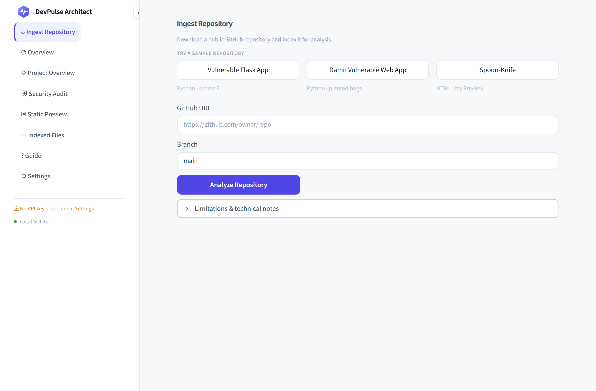

# DevPulse Architect

A Streamlit tool that pulls a public GitHub repository into a local index, scans every source file for security defects with static rules **and** an LLM, and exports a graded report as Markdown or PDF. It also renders a repo's static frontend and explains projects that ship without a README.

There is no backend service and **no code from the analyzed repository is ever executed** — analysis is static and safe.

<p align="center">
  
</p>

---

## Features

- **Ingest a GitHub repo** — download a public repo's branch ZIP, filter out binaries and dependency folders, and index every text file (plus 40-line overlapping chunks) into local SQLite.
- **Security audit** — two passes:
  - **Static heuristics** (14 CWE-tagged regex rules) run **free** over every source file. No API key required.
  - **LLM deep analysis** reads a prioritized subset and returns structured findings, merged and de-duplicated with the heuristic hits.
  - Produces severity tiles, a 0–100 score, an A–F grade, a filterable findings list, and **Markdown / PDF export**.
- **Multi-provider models** — pick **Google Gemini**, **OpenAI (GPT)**, or **Anthropic (Claude)**, choose a model, and paste the key in the UI. Keys live in memory for the session; an environment variable is the fallback.
- **Project overview** — renders the README, or asks your chosen model to explain a repo's purpose, structure, and architecture when there isn't one.
- **Static preview** — renders a repo's HTML with its CSS and JS inlined, in a sandboxed frame. Static only.
- **In-app guide** — a step-by-step walkthrough of every section, with screenshots, built into the app.
- **Light + dark themes** — one token-driven stylesheet that follows your OS, with an in-app override.

---

## Quick start

```bash
python -m venv venv
venv\Scripts\activate            # Windows
source venv/bin/activate         # macOS / Linux

pip install -r requirements.txt
streamlit run app.py --server.port 8505
```

Open <http://localhost:8505>. The app lands on **Ingest Repository**.

> **No API key needed to start.** The static rules, ingestion, indexing, static preview, and Markdown/PDF export all work with zero configuration. A key only unlocks the LLM deep-analysis pass and the AI project explanation.

### Try it in 30 seconds

1. **Ingest Repository** → click a sample button (e.g. **Vulnerable Flask App**) → **Analyze Repository**.
2. **Security Audit** → **Run Security Audit** → see a graded report with real findings.
3. Optional: **Settings** → pick a provider, paste a key, **Test connection** — then re-run the audit for AI-enriched findings.

---

## Models and keys

Set a key in the **Settings** section, or export the environment variable as a fallback (this is how you configure it on a host like Render).

| Provider | Models | Env var |
|---|---|---|
| Google Gemini | `gemini-2.5-flash` (default), `gemini-2.5-pro` | `GEMINI_API_KEY` |
| Anthropic (Claude) | `claude-opus-4-8` (default), `claude-sonnet-5`, `claude-haiku-4-5` | `ANTHROPIC_API_KEY` |
| OpenAI (GPT) | `gpt-4o` (default), `gpt-4o-mini` | `OPENAI_API_KEY` |

Copy `.env.example` to `.env` and fill in whichever keys you use — all are optional:

```bash
cp .env.example .env
```

> **Semantic search uses Gemini embeddings** (`gemini-embedding-001`), so it needs a Gemini key regardless of the chat provider. Without one, chunks store no embeddings and search degrades to keyword matching — nothing breaks, and the audit still runs.

---

## How the audit works

Two passes, deliberately asymmetric. Pass A is free and exhaustive; Pass B is expensive and selective. Nothing is *completely* unscanned even when the LLM budget runs out.

```
every indexed source file
        │
        ▼
Pass A — static heuristics        free · no cap · runs on EVERY file
14 regex rules, line by line      language-gated to cut false positives
        │
        ▼
prioritize (cap: 40 files, 40 KB) 1. files with heuristic hits
                                  2. files near risky vector-search terms
                                  3. the rest, smallest first
                                  everything dropped is LOGGED, never silent
        │
        ▼
Pass B — LLM deep analysis        one call per file, strict JSON out
seeded with that file's hits      a bad file is skipped, never aborts the run
        │
        ▼
merge + dedup (file, line, CWE) → score → grade → export
```

**Score** = `max(0, 100 − (critical×20 + high×10 + medium×4 + low×1))`
**Grade** = A ≥90 · B ≥80 · C ≥70 · D ≥60 · else F

The rule set covers hardcoded secrets and private keys, SQL injection, `eval`/`exec`, `os.system` / `shell=True` / `child_process.exec`, insecure deserialization, weak hashing (MD5/SHA-1), disabled TLS verification, debug mode, XSS sinks, and permissive CORS — each tagged with a CWE. Both passes can produce false positives; every finding names its source (`heuristic`, `llm`, or `both`) so you know how much to trust it. Static analysis is advisory, not a substitute for review.

---

## Project structure

```
app.py                     theme injection · sidebar nav · router · key export
theme.py                   TOKENS dict → one CSS-variable stylesheet (light + dark)

pages/
  dashboard.py             ingest · overview · project overview · preview · files · settings
  security_audit.py        run the audit, render findings, wire the exports
  guide.py                 in-app screenshot walkthrough

services/                  pure Python — no Streamlit imports below this line
  llm_service.py           provider registry · generate() · resolve_key() · test_connection()
  audit_service.py         RULES · heuristic scan · LLM pass · merge · score
  report_service.py        Markdown + PDF builders (fpdf2)
  database_service.py      thin facade over the store
  sqlite_service.py        schema + queries
  embedding_service.py     gemini-embedding-001
  similarity_service.py    cosine similarity

components/                cards.py (metric_card, severity_badge, empty_state), status.py
assets/guide/              screenshots used by the in-app guide
assistant.db               local SQLite (git-ignored): files, chunks, queries, audits
```

The `services/` layer has no Streamlit imports, so the analysis engine is reusable independently of the UI.

---

## Database schema (`assistant.db`)

Created automatically on first run.

| Table | Purpose | Key columns |
|---|---|---|
| `assistant_files` | Ingested files | `filename`, `file_type`, `content`, `language`, `size_bytes` |
| `assistant_file_chunks` | Overlapping text chunks + embeddings | `file_id`, `chunk_index`, `content`, `embedding` (JSON floats) |
| `assistant_queries` | Query/answer log | `question`, `plan`, `retrieved_files`, `answer` |
| `assistant_audits` | Security audit reports | `repo_name`, `summary`, `findings`, `score`, `grade`, `files_scanned`, `files_skipped` |

---

## Deploying

One process, one port — which is exactly what a free-tier host gives you:

```bash
streamlit run app.py --server.port $PORT --server.address 0.0.0.0
```

Set the provider env vars in the host's dashboard and the app picks them up as the fallback, so nobody has to paste a key.

> **The filesystem is ephemeral on most free tiers.** `assistant.db` is wiped on redeploy or cold start, so an indexed repository and its audit history do not survive a restart. Re-ingest, or point the app at a persistent volume.

---

## Tech

Python · Streamlit · SQLite · `google-genai` · `anthropic` · `openai` · `fpdf2`
