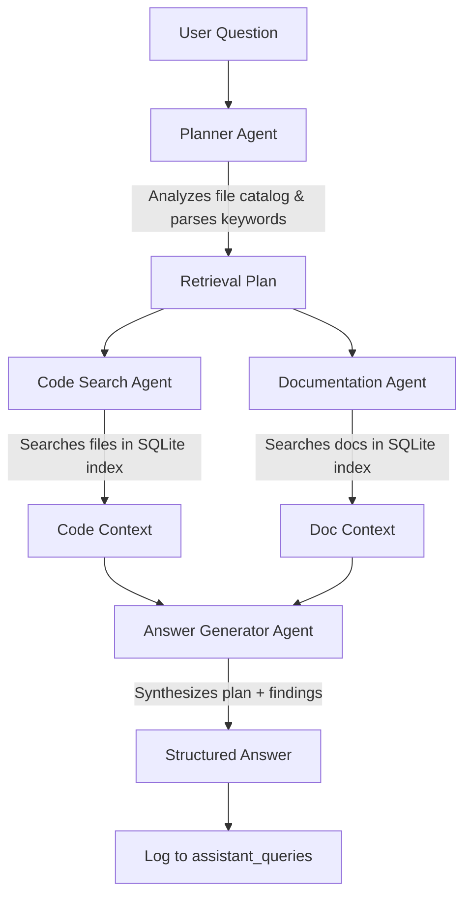

# Walkthrough: AI Software Engineer Assistant

This project implements a multi-agent system designed to act as an automated code reviewer, tester, and technical writer. It runs on a local **SQLite** database (`assistant.db`) to search codebases and documentation, using an agentic pipeline to solve complex developer queries.

## 🚀 Key Features

1. **Local SQLite Database Layer (`services/database_service.py`)**: Interacts with self-contained local SQLite tables (`assistant_files`, `assistant_file_chunks`, `assistant_queries`) for all search and storage operations.
2. **Multi-Agent Orchestrator (`agent_orchestrator.py`)**: Executes a structured pipeline powered by Gemini models:
   - **Planner Agent**: Analyzes the question and catalog, determines key terms and files to search.
   - **Code Search Agent**: Queries the SQLite index for relevant source code files.
   - **Documentation Agent**: Queries the SQLite index for API specs and architectural design documents.
   - **Answer Generator Agent**: Synthesizes the final answer using retrieved source files and documentation.
3. **Single-Page Streamlit Web Dashboard (`app.py`)**:
   - **Ingestion Workspace**: Upload files, clone public GitHub repositories, or paste text code snippets directly.
   - **Repository Accessibility Check**: Automatically validates GitHub URLs and blocks private repositories with clear warnings.
   - **Project Overview / Explanation**: Automatically detects a `README` file and displays its content. If none exists, uses the Gemini API to analyze the repository structure and contents to generate an architecture overview.
   - **Project Q&A Console**: Allows asking questions about the codebase, displaying execution steps and final answers from the Agent Swarm.
   - **Workspace File Manager**: Allows searching, viewing, and deleting indexed files.

---

## 🛠️ Project Structure

```
AI Software Engineer Assistant/
├── .env                  # Private configuration (loaded dynamically)
├── .env.example          # Template environment config
├── requirements.txt      # Python dependencies
├── app.py                # Main Streamlit web dashboard
├── agent_orchestrator.py # Multi-Agent workflow coordinator
├── services/
│   ├── sqlite_service.py # SQLite database tables & operations
│   ├── database_service.py # Database manager interface
│   ├── embedding_service.py # Gemini text embedding helper
│   └── similarity_service.py # Cosine similarity calculator
└── pages/
    └── dashboard.py      # Unified Dashboard Page
```

---

## 💻 Setup & Installation Instructions

### 1. Prerequisites
Ensure you have Python installed (Python 3.10+ recommended).

### 2. Install Dependencies
Run the package installation:
```bash
pip install -r requirements.txt
```

### 3. Environment Configurations
Create a `.env` file and set your Gemini API key:
```env
GEMINI_API_KEY=your-gemini-api-key
```

### 4. Run the Application
Start the Streamlit development server:
```bash
streamlit run app.py --server.port 8505
```
Open `http://localhost:8505` to view your workspace.

---

## 🎨 Premium Dark Layout
The application includes a state-of-the-art dark glassmorphic dashboard featuring:
* **Sidebar Nav**: Header logo (`⧡ AI Engineer`), active SQLite connection status, and direct tabbed menu controls.
* **Q&A Chat Feed**: Chat bubble inputs with agent progress expanders.
* **Limitations Info Panel**: Built-in guidance on rate limits, repository sizes, and private repo constraints.

---

## 🤖 Multi-Agent Workflow Blueprint



1. **Planner Agent**: Inspects the catalogs of filenames and writes a retrieval plan specifying search keywords and target files.
2. **Code Search Agent**: Interacts with the DB layer to query source code matches.
3. **Documentation Agent**: Queries API references, design diagrams, or requirement specifications.
4. **Answer Generator Agent**: Synthesizes the user query, code snippets, documentation, and plan guidelines into a clear, detailed response.
